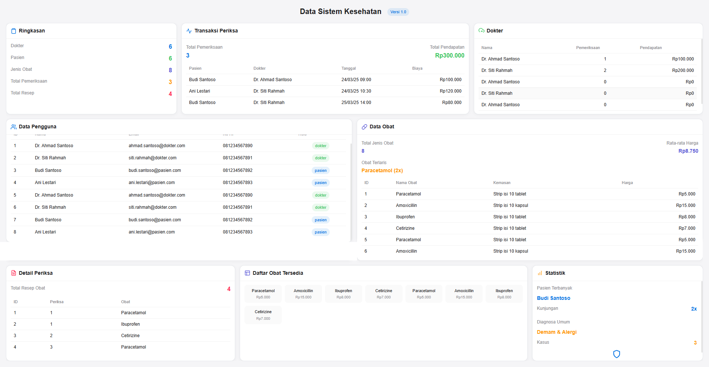

# 🏥 Dashboard Sistem Kesehatan



## 📋 Deskripsi

Dashboard Sistem Kesehatan adalah aplikasi visualisasi data untuk manajemen rumah sakit atau klinik yang menampilkan informasi penting dalam satu tampilan. Dashboard ini dirancang dengan inspirasi desain Apple yang minimalis dan elegan, memungkinkan pengguna untuk melihat semua data penting tanpa perlu melakukan scrolling.

## ✨ Fitur Utama

### 🔍 Tampilan Satu Layar (Single View)
- 📊 Semua data penting ditampilkan dalam satu layar tanpa scrolling
- 🖥️ Dioptimalkan untuk monitor dan layar besar
- 📱 Responsif untuk berbagai ukuran layar

### 👥 Manajemen Pengguna
- 👨‍⚕️ Tampilan data dokter dan jumlah pemeriksaan
- 🧑‍⚕️ Informasi pasien dan kunjungan
- 🔐 Pengelompokan berdasarkan peran (dokter, pasien, admin)

### 💊 Manajemen Obat
- 📦 Daftar obat tersedia dengan harga
- 📈 Statistik obat terlaris
- 💰 Rata-rata harga obat

### 📝 Pemeriksaan dan Transaksi
- 🧾 Riwayat pemeriksaan terbaru
- 💸 Total pendapatan dari pemeriksaan
- 📊 Statistik pemeriksaan per dokter

### 📊 Statistik dan Analitik
- 👤 Pasien dengan kunjungan terbanyak
- 🩺 Diagnosa umum yang sering terjadi
- 📈 Tren pemeriksaan dan penggunaan obat

### 🎨 Desain Modern
- 🍎 Terinspirasi dari desain Apple yang bersih dan minimalis
- 🌈 Kode warna intuitif untuk kategori data berbeda
- 🖌️ Kartu dengan bayangan halus dan animasi hover

## 🛠️ Teknologi yang Digunakan

- 🖥️ **Frontend**: HTML, CSS, Laravel Blade
- 🔄 **Backend**: Laravel PHP Framework
- 🗃️ **Database**: MySQL
- 📊 **Styling**: Custom CSS dengan inspirasi Apple Design

## 📦 Komponen Dashboard

1. **🔢 Kartu Ringkasan**
   - Menampilkan jumlah dokter, pasien, obat, pemeriksaan, dan resep

2. **💰 Kartu Transaksi**
   - Menampilkan total pemeriksaan dan pendapatan
   - Daftar transaksi terbaru

3. **👨‍⚕️ Kartu Dokter**
   - Performa dokter berdasarkan jumlah pemeriksaan
   - Pendapatan per dokter

4. **👥 Tabel Pengguna**
   - Daftar lengkap pengguna sistem
   - Filter berdasarkan peran

5. **💊 Tabel Obat**
   - Daftar obat dengan harga
   - Statistik penggunaan obat

6. **📋 Detail Pemeriksaan**
   - Riwayat resep obat
   - Hubungan antara pemeriksaan dan obat

7. **📊 Grid Obat**
   - Tampilan visual daftar obat tersedia
   - Harga dalam format yang mudah dibaca

8. **📈 Kartu Statistik**
   - Pasien dengan kunjungan terbanyak
   - Diagnosa yang paling umum
   - Indikator keamanan data

## 🗃️ Struktur Database

### 📊 Migrasi Database

Aplikasi ini menggunakan beberapa tabel utama yang dibuat melalui migrasi Laravel:

1. **👥 Tabel `users`**
   - Menyimpan data pengguna (dokter dan pasien)
   - Kolom: id, nama, alamat, no_hp, email, role, password, timestamps

2. **💊 Tabel `obat`**
   - Menyimpan data obat yang tersedia
   - Kolom: id, nama_obat, kemasan, harga, timestamps

3. **🩺 Tabel `periksa`**
   - Menyimpan data pemeriksaan pasien
   - Kolom: id, id_pasien, id_dokter, tgl_periksa, catatan, biaya_periksa, timestamps
   - Memiliki foreign key ke tabel users (id_pasien dan id_dokter)

4. **📋 Tabel `detail_periksa`**
   - Menyimpan detail obat yang diberikan pada pemeriksaan
   - Kolom: id, id_periksa, id_obat, timestamps
   - Memiliki foreign key ke tabel periksa dan obat

5. **🔐 Tabel `sessions`**
   - Menyimpan data sesi pengguna
   - Digunakan untuk autentikasi dan keamanan

### 🌱 Seeder Database

Aplikasi ini dilengkapi dengan seeder untuk mengisi data awal:

1. **👥 UserSeeder**
   - Membuat 2 dokter (Dr. Ahmad Santoso dan Dr. Siti Rahmah)
   - Membuat 2 pasien (Budi Santoso dan Ani Lestari)
   - Mengatur password default untuk semua pengguna

2. **💊 ObatSeeder**
   - Membuat 4 jenis obat (Paracetamol, Amoxicillin, Ibuprofen, Cetirizine)
   - Mengatur kemasan dan harga untuk setiap obat

3. **🩺 PeriksaSeeder**
   - Membuat 3 data pemeriksaan
   - Mencatat pemeriksaan antara dokter dan pasien dengan tanggal, catatan, dan biaya

4. **📋 DetailPeriksaSeeder**
   - Membuat 4 data detail pemeriksaan
   - Menghubungkan pemeriksaan dengan obat yang diberikan

5. **🔄 DatabaseSeeder**
   - Mengatur urutan eksekusi seeder (User → Obat → Periksa → DetailPeriksa)

### 📝 Model dan Relasi

Aplikasi ini menggunakan beberapa model dengan relasi yang saling terhubung:

1. **👤 Model `User`**
   - Mewakili pengguna sistem (dokter dan pasien)
   - Relasi:
     - `pemeriksaanSebagaiPasien()`: One-to-Many dengan Periksa (sebagai pasien)
     - `pemeriksaanSebagaiDokter()`: One-to-Many dengan Periksa (sebagai dokter)

2. **💊 Model `Obat`**
   - Mewakili obat yang tersedia dalam sistem
   - Relasi implisit dengan DetailPeriksa

3. **🩺 Model `Periksa`**
   - Mewakili pemeriksaan yang dilakukan
   - Relasi:
     - `pasien()`: Many-to-One dengan User (sebagai pasien)
     - `dokter()`: Many-to-One dengan User (sebagai dokter)
     - `detailPeriksa()`: One-to-Many dengan DetailPeriksa

4. **📋 Model `DetailPeriksa`**
   - Mewakili obat yang diberikan dalam pemeriksaan
   - Relasi implisit dengan Periksa dan Obat

## 🚀 Cara Menggunakan

1. Login ke sistem dengan kredensial yang diberikan
2. Dashboard akan langsung ditampilkan sebagai halaman utama
3. Lihat data secara keseluruhan dalam satu tampilan
4. Klik pada kartu atau baris tabel untuk melihat detail lebih lanjut (jika tersedia)
5. Gunakan fitur filter untuk menyaring data (jika diimplementasikan)

## 💻 Instalasi untuk Pengembangan

```bash
# Clone repositori
git clone https://github.com/username/health-dashboard.git

# Masuk ke direktori proyek
cd health-dashboard

# Install dependensi
composer install
npm install

# Salin file .env
cp .env.example .env

# Generate application key
php artisan key:generate

# Jalankan migrasi dan seeder
php artisan migrate --seed

# Jalankan server pengembangan
php artisan serve